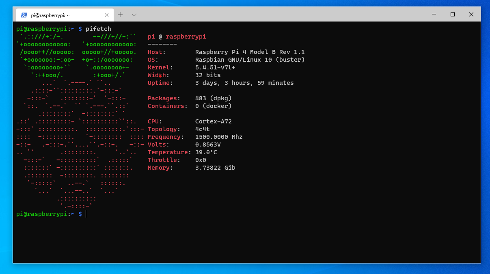

# Pifetch

A custom fetch script to dsiplay some Raspberry related information and Docker stats

Example:

## How to set up

Check out the [releases page](https://github.com/mikeanth-dev/pifetch/releases) for precompiled binaries.  
See the [wiki](https://github.com/mikeanth-dev/pifetch/wiki) for a more detailed installation guide.  

## Feedback, suggestions and help

For feedback, suggestions, bug reports etc., feel free to e-mail me at 'mike.anth99@gmail.com'.

---

_a project by Mircea-Pavel Anton (Mike Anthony)_
